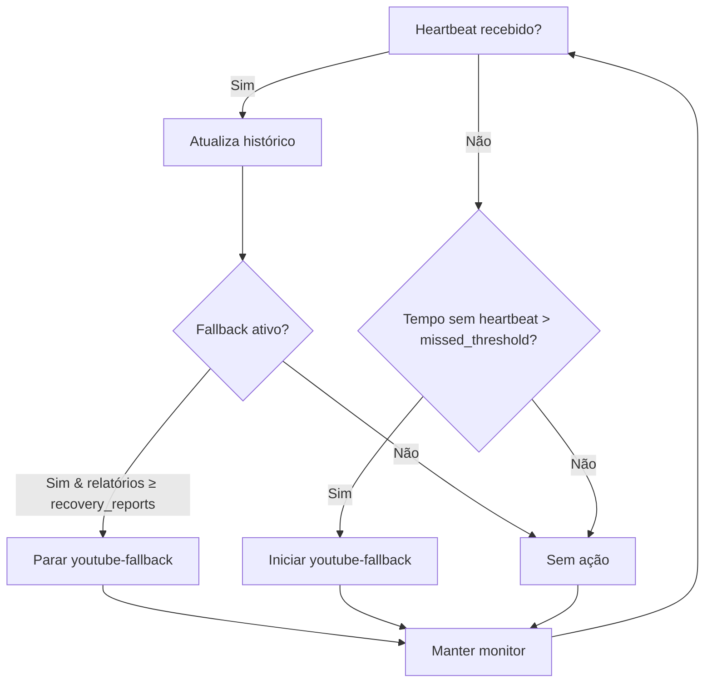

# 📘 Regras de Actuação — URL Secundária (YouTube Backup)

> **Nota de contexto:**  
> Este documento foi elaborado **antes da transferência completa para o repositório GitHub `bwb-stream2yt`**.  
> O conteúdo e o código aqui referidos correspondem ao **estado técnico original da solução instalada na droplet (DigitalOcean)** e **poderão ser posteriormente ajustados pelo Codex GPT** durante a integração e manutenção automatizada do projeto.  
> A presente versão serve como **base de documentação técnica e funcional** de referência inicial.

---

## 🔹 1. Objetivo
A **URL secundária** (backup) assegura a continuidade da transmissão para o YouTube quando a **URL primária** (principal) falha ou está inativa.  
Opera no *Droplet Linux (DigitalOcean)* e executa um *sinal de contingência* contínuo através do `ffmpeg`, monitorizado pelo serviço HTTP `bwb-status-monitor`.

---

## 🔹 2. Condições de Ativação

O serviço secundário (`youtube-fallback.service`) **entra em ação automaticamente** nas seguintes condições:

| Tipo de evento | Detetado por | Ação |
|----------------|--------------|------|
| Ausência de heartbeats acima do limiar configurado (`missed_threshold`) | `bwb_status_monitor.py` (monitor HTTP) | Solicita `systemctl start youtube-fallback.service` |
| Heartbeats consecutivos após falha (`recovery_reports`) | `bwb_status_monitor.py` | Solicita `systemctl stop youtube-fallback.service` |
| Queda de rede ou interrupção no Droplet | `systemd` (Restart=always) | Relança `bwb-status-monitor.service`; este reavalia e inicia o fallback se necessário |
| Reboot do servidor | `systemctl enable` | Monitor e fallback voltam com o mesmo mecanismo automático |

---

## 🔹 3. Condições de Desativação

A **URL secundária é interrompida automaticamente** quando:

| Condição | Ação |
|-----------|------|
| Heartbeats restabelecidos (>= `recovery_reports`) | `bwb_status_monitor.py` encerra o fallback de forma automática |
| Ordem manual de paragem | `systemctl stop youtube-fallback.service` |
| Necessidade de isolamento para diagnóstico | Utilize `status-monitor-debug.sh` para recolher evidências antes de qualquer intervenção manual |

---

## 🔹 4. Regras Operacionais

1. **Nunca desligar manualmente** o `bwb-status-monitor.service` — ele coordena o fallback com base nos heartbeats.
2. Se o YouTube indicar **“Configure corretamente as transmissões principal e de cópia de segurança”**, verificar primeiro se **apenas uma** URL está ativa.  
3. O `ffmpeg` do fallback deve manter:
   - Resolução: `1280x720`
   - FPS: `30`
   - Delay: `3.0s`
   - Bitrate vídeo: `3200k` (taxa alvo), `3500k` (maxrate) e `6000k` (bufsize)
   - Bitrate áudio: `128k`
   - Sample rate áudio: `44100`
   - Texto 1 (scroll): `BEACHCAM | CABO LEDO | ANGOLA`
   - Texto 2 (estático): `VOLTAREMOS DENTRO DE MOMENTOS`

4. Ajuste as variáveis do monitor (`/etc/bwb-status-monitor.env`) apenas se necessário: `BWB_STATUS_MISSED_THRESHOLD` (segundos sem heartbeats antes de ligar o fallback) e `BWB_STATUS_RECOVERY_REPORTS` (quantidade de relatórios consecutivos para desligar).
5. Após qualquer alteração de parâmetros, confirmar via `journalctl -u bwb-status-monitor youtube-fallback` e pelas *Estatísticas para nerds* da stream que o bitrate estabiliza próximo dos **3,2 Mbps**, sem underruns.

---

## 🔹 5. Supervisão Automática

Os serviços principais do Droplet:

| Serviço | Descrição | Estado esperado |
|----------|------------|----------------|
| `bwb-status-monitor.service` | Recebe heartbeats e controla `youtube-fallback.service` | `active (running)` |
| `youtube-fallback.service` | Envia o sinal de contingência para o YouTube | `inactive` quando heartbeats estão saudáveis; `active` quando em fallback |
| `/var/log/bwb_status_monitor.log` | Log do monitor HTTP (entrada por heartbeat e decisões) | Atualizado continuamente |

> O antigo CSV `yt_decider_log` foi fundido neste registo único; todas as consultas operacionais devem usar **exclusivamente** `/root/bwb_services.log`.

**Reação automática a falhas:**
- `Restart=always` no systemd
- `StartLimitIntervalSec=30`, `StartLimitBurst=10`
- Reinício garantido em <10 segundos

---

## 🔹 6. Ficheiros-Chave

| Caminho | Função |
|----------|--------|
| `/usr/local/bin/youtube_fallback.sh` | Script principal do sinal secundário |
| `/usr/local/config/youtube-fallback.defaults` | Defaults do slate (resolução, bitrates, textos) |
| `/etc/youtube-fallback.env` | Overrides conscientes (`YT_KEY`, ajustes específicos) — reescrito pelo `post_deploy.sh` preservando a chave |
| `/usr/local/bin/bwb_status_monitor.py` | Monitor HTTP que recebe heartbeats e aciona/paralisa o fallback |
| `/etc/systemd/system/youtube-fallback.service` | Unit de arranque e recuperação |
| `/etc/systemd/system/bwb-status-monitor.service` | Unit do monitor HTTP |
| `/var/lib/bwb-status-monitor/status.json` | Histórico recente de heartbeats rececionados |
| `/var/log/bwb_status_monitor.log` | Registo dedicado do monitor |

---

## 🔹 7. Fluxo de Decisão (Resumo)



> ⏱️ O `bwb_status_monitor.py` avalia o limiar de ausência de heartbeats a cada
> `check_interval` segundos (default: 5 s). A lógica de histerese depende apenas
> de `missed_threshold` e `recovery_reports` configurados em `/etc/bwb-status-monitor.env`.

---

## 🔹 8. Recuperação Manual

Para reiniciar tudo manualmente (ex.: após manutenção):

```bash
sudo systemctl daemon-reexec
sudo systemctl daemon-reload
sudo systemctl restart bwb-status-monitor youtube-fallback
sudo systemctl status bwb-status-monitor youtube-fallback --no-pager
```

---

## 🔹 9. Nota sobre Chaves e Segurança

- Utilize a variável `YT_KEY` definida em `/etc/youtube-fallback.env` (ver `secondary-droplet/config/youtube-fallback.env.example`) para configurar a chave do YouTube sem expor valores reais. O `post_deploy.sh` garante que o ficheiro mantém `YT_KEY` e repõe as linhas comentadas com os defaults atuais.
- Não incluir a chave em ficheiros públicos ou mensagens de suporte.
- O ficheiro `.env` é recriado com permissões `0644` e proprietário `root`; ajuste as permissões apenas se políticas locais exigirem algo mais restritivo.

---

## 🔹 10. Diagnóstico rápido

```bash
# Estado geral
systemctl status bwb-status-monitor youtube-fallback --no-pager

# Logs recentes
journalctl -u bwb-status-monitor -n 40 -l --no-pager
journalctl -u youtube-fallback -n 40 -l --no-pager

# Log centralizado
tail -n 100 /root/bwb_services.log
```
