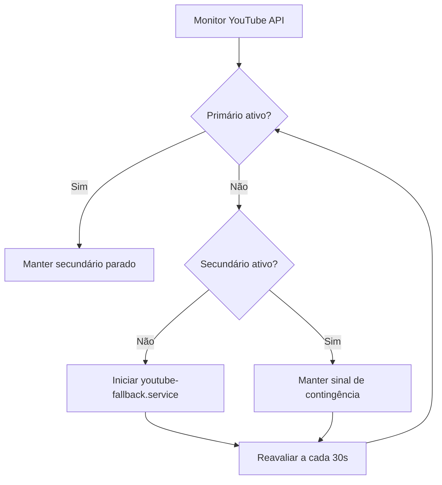

# 📘 Regras de Actuação — URL Secundária (YouTube Backup)

> **Nota de contexto:**  
> Este documento foi elaborado **antes da transferência completa para o repositório GitHub `bwb-stream2yt`**.  
> O conteúdo e o código aqui referidos correspondem ao **estado técnico original da solução instalada na droplet (DigitalOcean)** e **poderão ser posteriormente ajustados pelo Codex GPT** durante a integração e manutenção automatizada do projeto.  
> A presente versão serve como **base de documentação técnica e funcional** de referência inicial.

---

## 🔹 1. Objetivo
A **URL secundária** (backup) assegura a continuidade da transmissão para o YouTube quando a **URL primária** (principal) falha ou está inativa.  
Opera no *Droplet Linux (DigitalOcean)* e executa um *sinal de contingência* contínuo através do `ffmpeg`, monitorizado pelo `yt-decider-daemon`.

---

## 🔹 2. Condições de Ativação

O serviço secundário (`youtube-fallback.service`) **entra em ação automaticamente** nas seguintes condições:

| Tipo de evento | Detetado por | Ação |
|----------------|--------------|------|
| Falha total do sinal primário | `yt_decider_daemon.py` via API YouTube | Inicia o envio contínuo do sinal secundário |
| “Sem dados” ou stream parada há >10 min | `yt_decider_daemon.py` | Reinicia o fallback |
| Queda de rede ou interrupção no Droplet | `systemd` (Restart=always) | Relança `youtube-fallback.service` |
| Reboot do servidor | `systemctl enable` | Serviço relança automaticamente |

---

## 🔹 3. Condições de Desativação

A **URL secundária é interrompida automaticamente** quando:

| Condição | Ação |
|-----------|------|
| O sinal primário volta a transmitir corretamente | `yt_decider_daemon.py` encerra o fallback |
| Detetada sobreposição (ambas ativas) | Mantém primário, interrompe secundário |
| Ordem manual de paragem | `systemctl stop youtube-fallback.service` |

---

## 🔹 4. Regras Operacionais

1. **Nunca desligar manualmente** o `yt-decider-daemon` — é ele que comanda o fallback.  
2. Se o YouTube indicar **“Configure corretamente as transmissões principal e de cópia de segurança”**, verificar primeiro se **apenas uma** URL está ativa.  
3. O `ffmpeg` do fallback deve manter:
   - Resolução: `1280x720`
   - FPS: `30`
   - Delay: `3.0s`
   - Bitrate vídeo: `1500k`
   - Bitrate áudio: `128k`
   - Texto 1 (scroll): `BEACHCAM | CABO LEDO | ANGOLA`
   - Texto 2 (estático): `VOLTAREMOS DENTRO DE MOMENTOS`

4. O fallback **nunca deve ser desligado à noite**; deve permanecer ativo caso o primário falhe durante o período de inatividade local.

---

## 🔹 5. Supervisão Automática

Os serviços principais do Droplet:

| Serviço | Descrição | Estado esperado |
|----------|------------|----------------|
| `yt-decider-daemon.service` | Monitoriza a API do YouTube e comanda o fallback | `active (running)` |
| `youtube-fallback.service` | Envia o sinal de contingência para o YouTube | `active (running)` |
| `/root/bwb_services.log` | Log centralizado de decisões automáticas e eventos dos serviços | Atualizado continuamente |

> O antigo CSV `yt_decider_log` foi fundido neste registo único; todas as consultas operacionais devem usar **exclusivamente** `/root/bwb_services.log`.

**Reação automática a falhas:**
- `Restart=always` no systemd
- `StartLimitIntervalSec=30`, `StartLimitBurst=10`
- Reinício garantido em <10 segundos

---

## 🔹 6. Ficheiros-Chave

| Caminho | Função |
|----------|--------|
| `/usr/local/bin/youtube_fallback.sh` | Script principal do sinal secundário |
| `/etc/youtube-fallback.env` | Configuração de parâmetros (resolução, bitrate, chave YouTube) |
| `/usr/local/bin/yt_decider_daemon.py` | Monitor do estado da stream |
| `/etc/systemd/system/youtube-fallback.service` | Unit de arranque e recuperação |
| `/etc/systemd/system/yt-decider-daemon.service` | Unit do monitor principal |
| `/root/bwb_services.log` | Registo unificado de decisões e eventos dos serviços |

---

## 🔹 7. Fluxo de Decisão (Resumo)



---

## 🔹 8. Recuperação Manual

Para reiniciar tudo manualmente (ex.: após manutenção):

```bash
sudo systemctl daemon-reexec
sudo systemctl daemon-reload
sudo systemctl restart yt-decider-daemon youtube-fallback
sudo systemctl status yt-decider-daemon youtube-fallback --no-pager
```

---

## 🔹 9. Nota sobre Chaves e Segurança

- Chave atual: `f4ex-ztrk-vc4h-2pvc-2kg4`
- Não incluir a chave em ficheiros públicos.
- O `.env` deve ter permissões `600` e proprietário `root`.

---

## 🔹 10. Diagnóstico rápido

```bash
# Estado geral
systemctl status yt-decider-daemon youtube-fallback --no-pager

# Logs recentes
journalctl -u yt-decider-daemon -n 40 -l --no-pager
journalctl -u youtube-fallback -n 40 -l --no-pager

# Log centralizado
tail -n 100 /root/bwb_services.log
```
